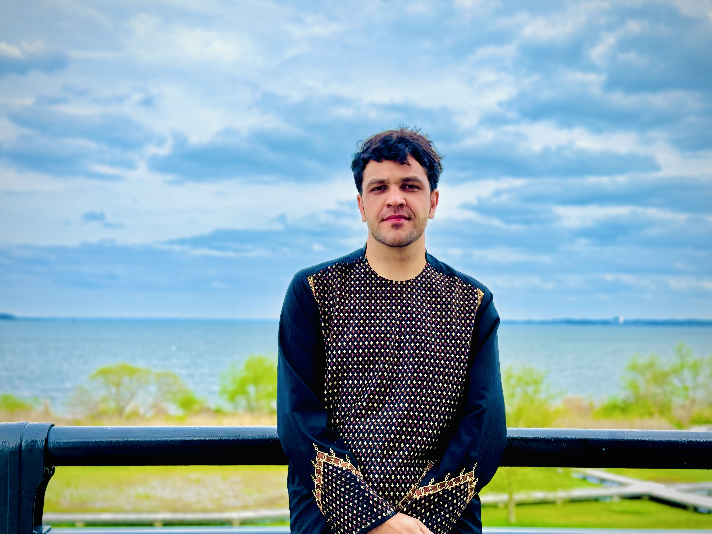

<!DOCTYPE html>
<html lang="en">
<head>
    <meta charset="UTF-8">
    <meta name="viewport" content="width=device-width, initial-scale=1.0">
    <meta name="description" content="Portfolio of Wali Khan Ahmadzai, showcasing academic achievements, research in Agricultural Economics, and professional experience.">
    <meta name="keywords" content="Wali Khan Ahmadzai, Agricultural Economics, Research, Work Experience, CV, Contact Information">
    <meta name="author" content="Wali Khan Ahmadzai">
    <title>Wali Khan Ahmadzai's Portfolio</title>
    <link rel="stylesheet" href="style.css">
</head>
<body>
    <header>
        

         <h1 class="portfolio-name">Wali Khan Ahmadzai</h1>
            <nav class="tabs-nav" aria-label="Main Navigation">
                <ul>
                    <li><a href="#" class="tab-link" data-tab="about" aria-current="page">About</a></li>
                    <li><a href="#" class="tab-link" data-tab="work">Work Experience</a></li>
                    <li><a href="#" class="tab-link" data-tab="research">Research</a></li>
                    <li><a href="#" class="tab-link" data-tab="cv">CV</a></li>
                    <li><a href="#" class="tab-link" data-tab="contact">Contact</a></li>
                    <li><a href="#" class="tab-link" data-tab="outreach">Professional Development</a></li>
                </ul>
            </nav>
        

    </header>

    <main>
        <section id="about" class="tab-content active">
            <h2>About Me</h2>
            

                
                
<strong>Current Position:</strong> Graduate Student in Agricultural Economics at the <a href="https://www.tsukuba.ac.jp/" target="_blank" rel="noopener noreferrer">University of Tsukuba</a>, Japan

                
<strong>Education:</strong>

                <ul>
                    <li><strong>MSc. Agricultural Economics</strong>, <a href="https://www.tsukuba.ac.jp/" target="_blank" rel="noopener noreferrer">University of Tsukuba</a> (April 2023 - March 2025, expected)</li>
                    <li><strong>BSc. Agricultural Economics and Extension</strong>, <a href="https://www.pu.edu.af/" target="_blank" rel="noopener noreferrer">Paktia University</a>, Afghanistan (2015-2018)</li>
                    <li><strong>Non-degree Research Student</strong>, Agricultural Economics, <a href="https://www.tsukuba.ac.jp/" target="_blank" rel="noopener noreferrer">University of Tsukuba</a> (April 2022 - March 2023)</li>
                </ul>
                
<strong>Short Bio:</strong>

                

                    
I hold a Master’s degree in Agricultural Economics from the University of Tsukuba, Japan. Previously, I served as a lecturer at Shaikh Zayed University, Afghanistan, where I contributed to the academic community for three years, honing my skills in teaching and research.

                    
Currently in my second year of graduate studies, my research centers on the intersection of Agricultural Economics and Behavioral Economics, enriched by coursework in Sustainability, Development Economics, and Environmental Economics.

                    
I am actively seeking Ph.D. opportunities to engage in multidisciplinary research that fosters impactful change in Agricultural Economics and related fields. My ultimate goal is to leverage my expertise to support sustainable development and economic resilience.

                

            

        </section>

        <section id="work" class="tab-content">
            <h2>Work Experience & Teaching</h2>
            
<strong>Teaching Assistant</strong>, <a href="https://szu.edu.af/en" target="_blank" rel="noopener noreferrer">Shaikh Zayed University</a>, Afghanistan (April 2019 - March 2022)

            
<strong>Research Assistant</strong>, University of Tsukuba, Japan (2022-Present)

            
<strong>Courses Taught:</strong>

            <ul>
                <li>AgEc520 - Development Economics (Spring 2019)</li>
                <li>AgEc731 - Production Economics (Fall 2019)</li>
                <li>AgEc418 - Econometrics (Spring 2020)</li>
                <li>AgEc630 - Applied Econometrics (Spring 2021)</li>
                <li>Lab Instructor - Econometrics Using R Programming (2023 - Present)</li>
            </ul>
        </section>

        <section id="research" class="tab-content">
            <h2>Research</h2>
            
<strong>Publications:</strong>

            <ul>
                <li>Ahmadzai, W. K., & Aryobi, H. G. (2021). "Natural and Socio-economic Factors Affecting the Household Food Security in Rural Areas of Paktia Province, Afghanistan." <i>Asian Journal of Agricultural Extension, Economics & Sociology</i>, 39(2), 1-11.</li>
            </ul>
            
<strong>Work in Progress:</strong>

            <ul>
                <li>Empowering Afghan Women through the Saffron Industry (Under Review)</li>
                <li>Japanese Consumers' Preferences for Afghan Saffron (Data Collection Stage)</li>
                <li>Afghan Consumer’s Perception of Genome-Edited Food (Analysis Stage)</li>
            </ul>
        </section>

        <section id="cv" class="tab-content">
            <h2>Curriculum Vitae</h2>
            <a href="Ahmadzai_CV.pdf" class="cv-link" download>Download My CV</a>
        </section>

        <!-- Contact Section: Fixed Error -->
        <section id="contact" class="tab-content">
            <h2>Contact</h2>
            
<strong>Email:</strong> 
                <a href="mailto:ah.walikhan@gmail.com">ah.walikhan@gmail.com</a> | 
                <a href="mailto:wk.ahmadzai.szu.edu.af">wk.ahmadzai.szu.edu.af</a>
            

            
<strong>Social Media:</strong>

            <ul>
                <li><a href="https://www.linkedin.com/in/wali-khan-ahmadzai-b179961a2/" target="_blank" rel="noopener noreferrer">LinkedIn</a></li>
                <li><a href="https://www.researchgate.net/profile/Wali-Khan-Ahmadzai" target="_blank" rel="noopener noreferrer">ResearchGate</a></li>
                <li><a href="https://x.com/WKAhmadzai1" target="_blank" rel="noopener noreferrer">X</a></li>
                <li><a href="https://www.facebook.com/AhmadziWaliKhan" target="_blank" rel="noopener noreferrer">Facebook</a></li>
                <li><a href="https://scholar.google.com/citations?user=yPdG7nsAAAAJ&hl=en&oi=ao" target="_blank" rel="noopener noreferrer">Google Scholar</a></li>
            </ul>
        </section>

        <section id="outreach" class="tab-content">
    <h2>Professional Development / Outreach</h2>
    
<strong>Internships:</strong>

    <ul>
        <li><strong>Intern at Japan Space System</strong>, Utilized satellite data and remote sensing techniques (Tokyo, Summer 2023)</li>
        <li><strong>Intern at GPSS Group</strong>, Collaborated with the marketing intelligence team (Tokyo, Summer 2024)</li>
    </ul>
    
<strong>Memberships:</strong>

    <ul>
        <li><strong>Member</strong>, Japan Agricultural Economics Society (2023 - Present)</li>
        <li><strong>Member</strong>, Japan Food System Society (2023 - Present)</li>
    </ul>
    
<strong>Conference Presentations:</strong>

    <ul>
        <li><strong>Japan Food System Conference (2023)</strong>, Topic: "The Role of Saffron in Sustainable Agricultural Practices in Afghanistan"</li>
    </ul>

    <!-- Languages Section -->
    

        <h3>Languages</h3>
        <ul class="language-list">
            <li><strong>Pashto:</strong> Native proficiency</li>
            <li><strong>Dari (Persian):</strong> Professional proficiency</li>
            <li><strong>English:</strong> Advanced proficiency</li>
            <li><strong>Japanese:</strong> Conversational proficiency</li>
            <li><strong>Urdu & Hindi:</strong> Basic understanding</li>
            <li><strong>Arabic:</strong> Literate (can read and write)</li>
        </ul>
    

</section>
    </main>

    <footer style="margin: 0; padding: 10px; text-align: center;">
        
&copy; 2024 Wali Khan Ahmadzai. All rights reserved.

    </footer>

    
</body>
</html>
